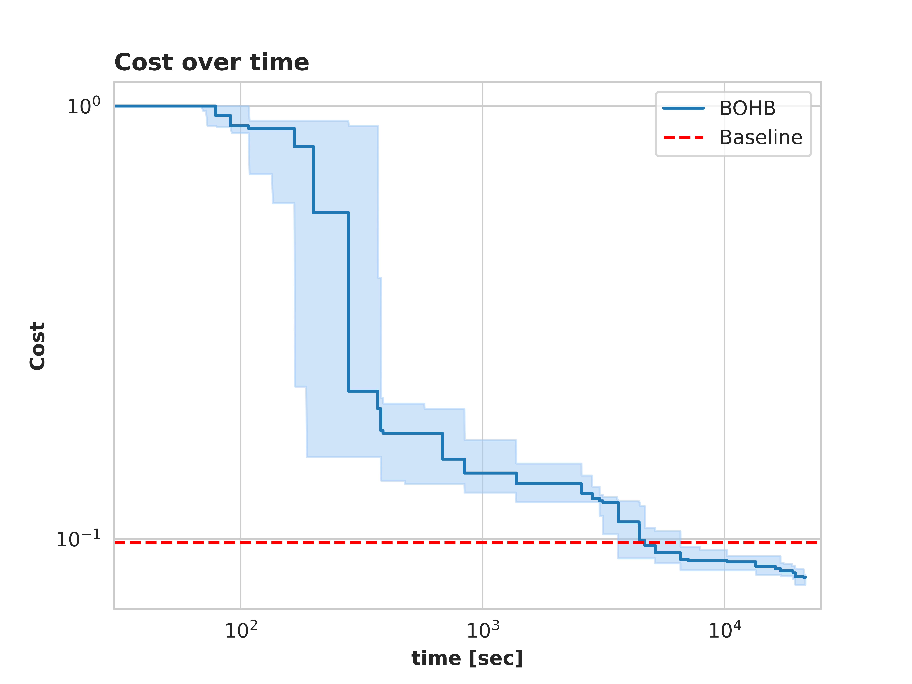
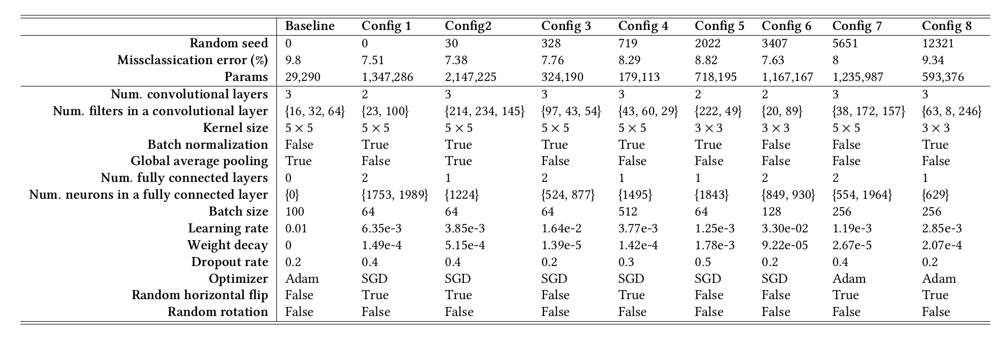

# Joint Architecture Search and Hyperparameter Optimization of a Convolutional Neural Network

This repository is the implementation of the AutoML 2022 final project [JAHS_Fashion](https://github.com/automl-classroom/final-project-multiverse/blob/master/jahs_fashion/project_jahs_fashion.pdf).

## Requirements

- Python (3.9)
- Pytorch (1.12.1)
- matplotlib 
- numpy 
- pandas 
- scikit_learn
- tqdm
- torchsummary
- configspace
- smac

Dependencies can be installed using the following command:
```bash
conda env create -f environment.yml
```


## Data

The Fashion-MNIST dataset used in the project can be found in the repo [Fashion-MNIST](https://github.com/zalandoresearch/fashion-mnist). The required data files will also be automatically downloaded to ```./dataset``` folder by default. A demo slice of the Fashion-MNIST data is illustrated in the following figure.


<p align="center">

<br><br>
<b>Figure 1.</b> An example of the Fashion-MNIST data.
</p>


## Repo structure

*  Source folder      
   
   * [search_space.py](search_space.py)<BR>
     contains joint search space.
   
   * [main.py](main.py)<BR>
     contains the main script to conduct the experiment.
   
   * [train_optim.py](train_optim.py)

     contains code to run complete training and testing procedure with early stopping mechanism on the optimal configuration. (Runs automatically after the search is complete, or can be run separately.)
   
   * [example_bohb.py](bohb.py) <BR>
     contains a simple example of how to use BOHB in SMAC on the dataset. 
   
   * [baseline.py](baseline.py)<BR>
     contains a simple baseline that reaches 0.902 accuracy on the test sets. The optimized network should be at least on par with this baseline. Further benchmarks can be found under [Fashion-MNIST Benchmark](https://github.com/zalandoresearch/fashion-mnist#benchmark).
   
   * [cnn.py](cnn.py)<BR>
     contains the source code of an example network you could optimize.
   
   * [utils.py](utils.py)<BR>
     contains simple helper functions for [cnn.py](cnn.py)


## Usage

The detailed descriptions about the arguments are as following:

| Parameter name | Description of parameter                                     |
| -------------- | ------------------------------------------------------------ |
| runtime        | The running time allocated to run the algorithm (defaults to `21600`). |
| data_dir       | The directory where dataset are stored (defaults to `./dataset`). |
| working_dir    | The directory where intermediate results are stored (defaults to `./tmp`). |
| max_epochs     | The maximal number of epochs to train the network (defaults to `20`). |
| seed           | The random seed (defaults to `0`).                           |
| device         | The device used for running experiments (defaults to `cpu`)  |


## Results

I have uploaded the results of all 8 experiments mentioned in the report to the `./results` folder.

<p align="center">

<br><br>
<b>Figure 2.</b> Cost over time distribution of 8 runs (median and 25 ∼ 75% quartiles range).
</p>

<p align="center">

<br><br>
<b>Figure 3.</b> Hyperparameter importance plot and Parallel Coordinate plot of all evaluated configurations.
</p>

<p align="center">

<br><br>
<b>Figure 4.</b> The baseline and the searching results with different random seeds.
</p>